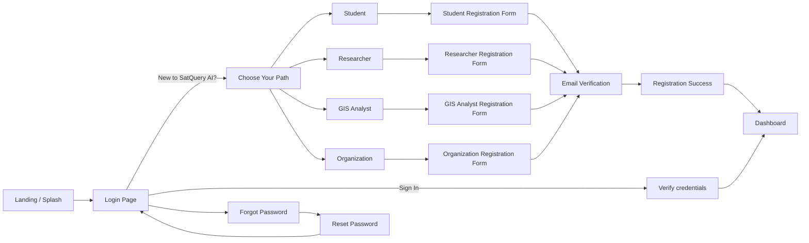

# SatQuery AI — Full Project Build Specification

**Interactive Vision-Language Assistant for Multimodal Remote Sensing Image Analysis**
SIH26167 / SIH6167 · Consolidated Build Spec v2.0 · September 2026

> This document merges the existing **PRD**, **TRD**, and **Dataset & Database Reference** with the three approved UI reference boards (`Authentication Flow`, `Mobile App`, `Web Dashboard`) into a single actionable build spec — **as-is**, plus the additional requirements below:
> - Fully **working, real-time** UI (no static mocks — live job status, live map, live notifications)
> - A **role-selection gate** right after the login/landing screen (Student / Researcher / GIS Analyst / Organization)
> - **Role-specific registration forms** (different fields per role)
> - An expanded **Settings** page with **auto-logout on inactivity** and **password change with verification**

---

## 1. Product Snapshot

| | |
|---|---|
| **Product** | SatQuery AI — "Understand Earth. Just Ask." |
| **Core idea** | Natural-language Q&A over satellite imagery (optical, SAR, multi-date), grounded with map overlays, confidence scores, and exportable reports |
| **Three mandated specialist modes** | (1) Single-image VQA & Grounding, (2) Bi-temporal / time-series Change Detection, (3) Optical–SAR Fusion |
| **Primary personas** | Disaster Response Coordinator, Urban Planner/Gov Officer, Defense/Intelligence Analyst, Environmental/Agricultural Analyst, Researcher/Student/General Public |
| **Design language** | Deep navy space theme, cyan/blue accent (`#2F80ED`–`#38BDF8` range), glassmorphic cards, Earth/satellite imagery hero art, map-first dashboard |

---

## 2. Tech Stack (carried from TRD, use as-is)

| Layer | Stack |
|---|---|
| Frontend (Web) | React + TypeScript, Tailwind CSS, Leaflet/OpenLayers or MapLibre GL |
| Frontend (Mobile) | React Native (or Flutter) sharing the design tokens from the web app |
| Backend API | Python FastAPI (ML-heavy services); lightweight Node.js gateway acceptable |
| Realtime layer | WebSocket (FastAPI `websockets` / Socket.IO) or SSE for job status, alerts, notification bell |
| Orchestration / Agent | LLM with function/tool-calling, LangGraph-style router, Celery/RQ task queue |
| ML / Specialist models | PyTorch, HuggingFace Transformers (VLM base), timm/segmentation-models-pytorch |
| Geospatial processing | GDAL, Rasterio, rio-cogeo, Shapely, GeoPandas, PyProj |
| Database | PostgreSQL 15+ with PostGIS, Redis (cache/queue/session store) |
| Object storage | S3-compatible (AWS S3 / MinIO) — rasters, COG tiles, reports |
| Inference serving | Triton Inference Server / TorchServe behind elastic GPU autoscaling |
| Auth | OAuth2 / OIDC + JWT (short-lived access + refresh token), API keys for programmatic access, MFA for Admin/Organization roles |
| CI/CD | GitHub Actions (lint → test → build → deploy) |
| Observability | Prometheus + Grafana, ELK/OpenSearch, Sentry |
| Containerization | Docker + Kubernetes (Docker Compose for local/MVP) |

---

## 3. Reference UI Screens (from the 3 composite boards)

### 3.1 Authentication & Onboarding board
1. Login Page
2. Registration Page
3. Role Selection (Onboarding) — Researcher / Student / GIS Analyst / Organization
4. Forgot Password (Step 1)
5. Reset Password (Step 3)
6. Registration Success

### 3.2 Mobile App board
Home, New Analysis (Satellite/SAR/Fusion tabs), Lake/Result Details, Analysis History, Upload Satellite Image, Ask SatQuery AI (chat), Map View (layers), Profile (**Settings entry point**)

### 3.3 Web Dashboard board
Dashboard/Home, New Analysis + Map View, Change Detection compare slider, Generate/Download Report, Analysis History, Mobile companion view

**Build rule:** every screen in the three boards must be implemented as a real, data-driven screen — not a static image. Placeholder/demo data is acceptable only until backend endpoints exist, and must be clearly wired to real API calls once they do (see §9, Real-Time Requirements).

---

## 4. Updated Authentication & Onboarding Flow

The original flow was `Login → Register → Role Selection (onboarding, post-signup)`. Per the new requirement, **role selection moves to immediately after the landing/login screen**, and drives a **role-specific registration form**. Final flow:



### 4.1 Login Page (unchanged, as-is)
- Email + password, "Remember me", "Forgot password?"
- OAuth: Continue with Google, Continue with Microsoft
- Footer: `New to SatQuery AI? Create an account` → routes to **Choose Your Path** (§4.2), not straight to a generic form
- Status strip: `SYSTEM ONLINE · GIS READY · VLM READY` — this strip **must reflect real backend health checks** (`GET /api/v1/health`), not a static label

### 4.2 "Choose Your Path" — Role Gate (NEW, replaces/precedes old Step-1-of-2 onboarding)
Reuse the visual pattern from the existing "Role Selection (Onboarding)" screen (4 cards, icon + title + subtitle), but present it:
- Right after "Create an account" is clicked (pre-registration), **and**
- Optionally offered again post-first-login for existing users who want a role-specific home layout

| Role card | Icon | Subtitle | Maps to `account_type` |
|---|---|---|---|
| **Student** | 🎓 cap | "For learning and exploration" | `student` |
| **Researcher** | 🧪 flask | "For academic and scientific research" | `researcher` |
| **GIS Analyst** | 🛰 radar | "For professional geospatial analysis" | `gis_analyst` |
| **Organization** | 🏢 building | "For government, industry or enterprise" | `organization` |

Selecting a card routes to that role's registration form (§4.3). Each card is a real, clickable component — not decorative.

### 4.3 Role-Specific Registration Forms (NEW)

All forms share the base fields (Full Name / Org Name, Email, Password, Confirm Password, Terms & Privacy checkbox, `Create Account` button, `Already have an account? Sign in`) plus **role-specific fields**:

**Student**
| Field | Type | Notes |
|---|---|---|
| Full Name | text | required |
| Email address | email | accept any domain; show a soft badge "Academic email detected" if domain matches known `.edu`/`.ac.*` patterns |
| Institution / College | text | required |
| Course / Program | text | e.g. "B.Tech Geoinformatics" |
| Year of Study | select | 1st–5th / Postgraduate |
| Password / Confirm Password | password | strength meter |

**Researcher**
| Field | Type | Notes |
|---|---|---|
| Full Name | text | required |
| Email address | email | required |
| Institution / Organization | text | required |
| Research Field / Domain | select | Remote Sensing, Climate, Urban Studies, Agriculture, Disaster Mgmt, Other |
| ORCID ID | text | optional |
| Publication / Profile link | url | optional |
| Password / Confirm Password | password | strength meter |

**GIS Analyst**
| Field | Type | Notes |
|---|---|---|
| Full Name | text | required |
| Email address | email | required |
| Employer / Organization | text | required |
| Job Title | text | e.g. "GIS Specialist" |
| Years of Experience | select | 0–2 / 3–5 / 6–10 / 10+ |
| Primary GIS Tools Used | multi-select | QGIS, ArcGIS, ERDAS, Other |
| Password / Confirm Password | password | strength meter |

**Organization**
| Field | Type | Notes |
|---|---|---|
| Organization Name | text | required — becomes `organizations.name` |
| Organization Type | select | Government, Defense, NGO, Private/Industry, Academic Institution — maps to `organizations.tier` |
| Official Email Domain | text | validated (e.g. `@nic.in`, `@isro.gov.in`), used for auto-joining teammates later |
| Admin Contact Name | text | required — first user is created with `role = admin` |
| Admin Email | email | required |
| Team Size | select | 1–10 / 11–50 / 51–200 / 200+ |
| Intended Use Case | multi-select | Disaster Response, Urban Planning, Defense/Intel, Environmental Monitoring, Other |
| Password / Confirm Password | password | strength meter, **MFA is enforced at first login** for this account type per TRD §8 security requirement |

> **Schema note:** add an `account_type` column to the `users` table (`student | researcher | gis_analyst | organization`) — this is distinct from the existing RBAC `role` column (`admin | analyst | viewer`). `account_type` drives the personalized dashboard/home content and default feature visibility (e.g., Students/Researchers default into a simplified VQA mode; GIS Analysts/Organizations default into full multi-layer mode), while `role` continues to drive permissions.

### 4.4 Email Verification (NEW — required before first login completes)
- After "Create Account", send a 6-digit OTP or verification link to the provided email
- Show a verification screen: "We've sent a code to `<email>`" with a 6-digit input, `Resend code` (60s cooldown), `Change email`
- Account remains `pending_verification` until confirmed; unverified accounts cannot request analysis jobs

### 4.5 Forgot / Reset Password (unchanged, as-is)
Enter email → secure reset link → new password with live checklist (8+ chars, a number, a special character, passwords match) → "Back to Sign In"

### 4.6 Registration Success (unchanged, as-is)
Green checkmark, "Account Created!", `Go to Dashboard` — dashboard shown is now **personalized by `account_type`** (e.g., Organization admins land on a workspace-setup checklist; Students land on a guided "Try asking…" tour).

---

## 5. Application Screens — Behavior Spec

### 5.1 Dashboard / Home
- `Upload Satellite Image` and `Ask About an Image` tiles are real actions wired to `/api/v1/images/upload` and the query flow
- "Try asking" chips (`Find all water bodies`, `Detect deforestation`, `Identify new construction`, `Compare these two images`) pre-fill the query bar and submit on click
- Status strip (`AI Engine Online / GIS Ready / VLM Connected / SAR Processor Ready`) polls `/api/v1/health` every 30s and reflects true service state, including a degraded/offline state with a toast

### 5.2 New Analysis / Map View
- `Optical | SAR | Fusion` tabs switch active raster layer for the same AOI
- Layers panel checkboxes toggle real GeoJSON layers (Detected Objects, Roads, Water Bodies, Buildings, Vegetation) on/off client-side without refetching
- `Ask SatQuery…` bar submits to `POST /api/v1/query`; while a job is `queued`/`running`, show an inline progress state (see §9) — never a frozen spinner with no feedback
- Results table + AI Insight panel + Confidence bar populate from the **actual** job result payload (`answer_text`, `confidence`, per-object rows), not hardcoded numbers
- Evidence chips are clickable and pan/zoom the map to the referenced region (ties to PRD §16.2)

### 5.3 Change Detection
- Before/After compare slider bound to two real image ids for the AOI
- Change Summary (`New Construction`, `Deforestation`, `Waterbody Change`, `Overall Change`) computed server-side by the Change Detection specialist, not static text

### 5.4 Reports
- `Generate Report` triggers `GET /api/v1/results/{result_id}/report`; show a real progress state, then a `Preview Report` / `Download` pair
- Export format selector (PDF / CSV / GeoJSON) must produce a genuinely downloadable file per format

### 5.5 Analysis History
- Backed by the `jobs` + `results` tables; search/filter (`Today / This Week / This Month`) hits a real query, not a client-side filter over fake data

### 5.6 Profile
- Avatar, name, email, plan (`Pro` badge etc.), Storage & Usage bar bound to real object-storage consumption
- `Sign Out` invalidates the session server-side (not just clears local token)
- `Account Settings` → routes to the expanded Settings page (§6)

---

## 6. Settings Page — Full Spec (existing items **+ new required items**)

Group the Settings screen into these sections:

### 6.1 Account Settings *(existing)*
Name, email, avatar, organization/workspace (if applicable), role badge (Admin/Analyst/Viewer), `account_type` badge (Student/Researcher/GIS Analyst/Organization)

### 6.2 Notification Preferences *(existing)*
Email / SMS / Webhook toggles for: monitored-AOI alerts, weekly digest, product updates

### 6.3 Security *(NEW — expanded, this is the section the user specifically asked for)*

**A. Auto-Logout on Inactivity**
- Setting: `Auto-lock after inactivity` — dropdown: `5 min / 15 min / 30 min (default) / 60 min / Never`
- For `organization` tier = Government/Defense, **`Never` is disabled** and the maximum allowed is 15 min, enforced server-side (not just hidden in UI) per TRD §8 tenant-isolation/compliance posture
- Behavior spec (see full detail in §7 below): idle timer resets on mouse/keyboard/touch/scroll activity and on any authenticated API call; a warning modal with a live countdown appears 60s before logout with a `Stay signed in` button; on timeout, session + refresh token are invalidated server-side and the user is routed to the Login page with a toast: *"You were signed out due to inactivity."*

**B. Change Password (with verification)**
- Fields: `Current Password`, `New Password`, `Confirm New Password`, live strength meter + checklist
- Flow (full detail in §8): re-authentication with current password → OTP/email verification step → password updated → all other active sessions/devices are invalidated → confirmation email sent
- `Forgot your current password?` link routes to the standard reset-password flow instead

**C. Two-Factor Authentication (MFA)**
- Toggle to enable TOTP-based 2FA (authenticator app) or email OTP
- **Mandatory and non-optional for `admin` role users and for `organization` accounts on Government/Defense tier**, per TRD §8/§13

**D. Active Sessions / Devices**
- List of active sessions (device, location/IP, last active) with a `Sign out` action per session and a `Sign out of all other sessions` button — this button is also triggered automatically after a password change

**E. API Keys** *(Organization/Analyst+ only)*
- Create/revoke programmatic API keys (`POST/DELETE` against `api_keys` table), each shown once at creation, hashed at rest

### 6.4 Storage & Usage *(existing)*
Usage bar (e.g., `2.4 GB / 10 GB`), breakdown by rasters/reports/cache, `Clear cache` action

### 6.5 Data & Privacy *(NEW, recommended addition)*
Download my data (export account + analysis history), Delete account (soft-delete with a confirmation step and 30-day recovery window, per TRD backup/DR policy)

### 6.6 Help & Support / About *(existing)*
Docs link, contact support, app version (`v1.0.0`)

---

## 7. Auto-Logout System — Detailed Spec (NEW requirement)

**Goal:** protect sensitive imagery/analysis sessions (especially government/defense tenants) by ending idle sessions automatically.

**Client-side behavior**
1. On login, start an idle timer set to the user's configured interval (`inactivity_timeout_minutes`, default 30).
2. Reset the timer on: `mousemove`, `keydown`, `click`, `scroll`, `touchstart`, and on every successful authenticated API/WebSocket message — but **throttle** the reset (e.g., at most once every 5s) to avoid excessive re-renders.
3. At `timeout − 60s`, show a non-dismissible-by-click-outside modal: *"You'll be signed out in 60s due to inactivity"* with a live countdown and a `Stay signed in` button.
4. `Stay signed in` calls a lightweight `POST /api/v1/auth/heartbeat` to refresh the session and resets the timer.
5. If the countdown reaches 0 with no action, the client clears local tokens, calls `POST /api/v1/auth/logout`, and redirects to `/login` with the inactivity toast.
6. If the browser tab is backgrounded, use the `visibilitychange`/`Page Visibility API` plus a server-side session `expires_at` as the source of truth — **never trust the client clock alone**, since a user could tamper with it.

**Server-side behavior**
1. Every JWT/session carries `issued_at`, `last_seen_at`, and `expires_at = last_seen_at + inactivity_timeout`.
2. Every authenticated request updates `last_seen_at` (cheap Redis write) and rejects the request with `401 SESSION_EXPIRED` if `now > expires_at`.
3. `inactivity_timeout` is read from the user's Settings preference, clamped by the organization's tenant policy (e.g., Government/Defense max 15 min, cannot be set to "Never").
4. Logging out (manual or automatic) revokes the refresh token in the `sessions`/`refresh_tokens` table (add this table if not already present) so a stolen access token cannot be silently refreshed after logout.
5. Log the automatic-logout event to `audit_log` (`action = 'session_expired'`).

**New/updated schema:**
```sql
-- New table: sessions
sessions (
  session_id UUID PK,
  user_id UUID FK -> users.user_id,
  refresh_token_hash TEXT,
  device_label TEXT,
  ip_address TEXT,
  created_at TIMESTAMP,
  last_seen_at TIMESTAMP,
  expires_at TIMESTAMP,
  revoked BOOLEAN DEFAULT FALSE
);

-- users table addition
ALTER TABLE users ADD COLUMN inactivity_timeout_minutes INTEGER DEFAULT 30;
ALTER TABLE users ADD COLUMN account_type TEXT; -- student | researcher | gis_analyst | organization
ALTER TABLE users ADD COLUMN mfa_enabled BOOLEAN DEFAULT FALSE;
ALTER TABLE users ADD COLUMN email_verified BOOLEAN DEFAULT FALSE;
```

---

## 8. Password Change with Verification — Detailed Spec (NEW requirement)

**Flow (Settings → Security → Change Password):**
1. User enters **Current Password**, **New Password**, **Confirm New Password**.
2. Client-side checklist validates the new password live: ≥8 characters, at least one number, at least one special character, new ≠ current, confirm matches.
3. On submit, backend (`POST /api/v1/auth/change-password`) first **re-verifies the current password hash** — reject with `403` if wrong, and rate-limit repeated failures (e.g., 5 attempts / 15 min) to prevent brute forcing.
4. If the current password is correct, the backend sends a **6-digit OTP to the account's verified email** (or, if MFA/TOTP is enabled, prompts for the authenticator code instead of email OTP) and returns a `verification_id`.
5. UI shows a verification step: *"Enter the 6-digit code sent to `j***@example.com`"* with `Resend code` (60s cooldown) and `Verify & Change Password`.
6. On correct OTP, backend updates `users.password_hash`, sets `password_changed_at = now()`, **revokes all other active sessions** (§7's `sessions` table — `revoked = true` for every session except the current one), and sends a confirmation email ("Your password was changed on `<date>` from `<device/IP>`. Not you? Reset your password immediately.").
7. Log the event to `audit_log` (`action = 'password_changed'`).
8. On the client, show a success toast and, if desired, offer `Sign out of all other devices` (already done automatically in step 6, so this is just a confirmation state).

**Edge cases to handle:**
- OTP expires after 10 minutes → user must restart the flow.
- Too many wrong-OTP attempts (e.g., 5) → temporarily lock the change-password flow for 15 minutes and notify the user by email.
- New password identical to a recent previous password (optional, recommended for Government/Defense tier) → reject with "Choose a password you haven't used recently."

---

## 9. Real-Time Functionality Requirements (applies across the whole app)

The person building this must ensure the UI is **live**, not a static prototype:

| Feature | Real-time mechanism |
|---|---|
| Job status (`queued → running → succeeded/failed`) after submitting a query | WebSocket channel `ws/jobs/{job_id}` (fallback: poll `GET /api/v1/jobs/{job_id}` every 2s) — the results panel updates the moment the job completes, no manual refresh |
| Notification / alert bell | WebSocket channel `ws/notifications/{user_id}`; unread badge count updates live when a monitored AOI alert fires |
| Health/status strip (`AI Engine Online`, `GIS Ready`, etc.) | Poll `GET /api/v1/health` every 30s |
| Map layer updates after analysis | GeoJSON overlays fetched and rendered as soon as `results.geojson_path` is available — no page reload |
| Active-sessions list (Settings → Security) | Refetch on page focus, plus a live "this device" indicator |
| Auto-logout countdown | Client-side timer synced against server `expires_at`, as in §7 |
| Multi-device password-change propagation | Other open tabs/devices receive a `session_revoked` WebSocket event and are redirected to Login immediately, not just on their next request |

Implementation note: use a single WebSocket connection per client multiplexed by channel/topic (e.g., Socket.IO namespaces or a simple `{type, payload}` envelope over one raw WebSocket) rather than opening a new socket per feature.

---

## 10. Database Schema (from Dataset & Database Reference, PostgreSQL + PostGIS — as-is, plus additions marked NEW)

| Table | Purpose |
|---|---|
| `organizations` | Tenant/workspace root — `org_id`, `name`, `tier` (public/government/defense), `created_at` |
| `users` | `user_id`, `org_id` FK, `email`, `role` (admin/analyst/viewer), `password_hash`, `created_at`, **NEW:** `account_type`, `inactivity_timeout_minutes`, `mfa_enabled`, `email_verified`, `password_changed_at` |
| `api_keys` | Programmatic access keys, hashed, revocable |
| `images` | Ingested rasters — modality, CRS, bounds (PostGIS polygon), resolution, band count, acquisition time |
| `queries` | Submitted NL queries — text, language, classified intent |
| `query_images` | Link table: query ↔ image(s) |
| `jobs` | Specialist execution — specialist type, model version, status, timestamps |
| `results` | Job output — answer text, confidence, GeoJSON/heatmap/report paths |
| `monitors` | Saved AOI subscriptions — frequency, change threshold, alert channel |
| `alerts` | Dispatched alerts tied to a monitor + result |
| `feedback` | Human-in-the-loop corrections |
| `annotations` | Shared map comments |
| `audit_log` | Immutable action log — user, action, reference id, model version |
| **`sessions`** *(NEW)* | Active session/device tracking for auto-logout + multi-device sign-out |
| **`email_verifications`** *(NEW)* | OTP codes for registration email verification and password-change verification — `verification_id`, `user_id` FK, `purpose` (`register`/`password_change`), `code_hash`, `expires_at`, `consumed` |

---

## 11. API Endpoints (from TRD §5, + new auth/role/security endpoints)

**Existing (as-is):**
```
POST   /api/v1/images/upload
POST   /api/v1/images/fetch
GET    /api/v1/images/{id}/metadata
POST   /api/v1/query
GET    /api/v1/jobs/{job_id}
GET    /api/v1/results/{result_id}/geojson
GET    /api/v1/results/{result_id}/report
POST   /api/v1/monitors
DELETE /api/v1/monitors/{id}
POST   /api/v1/feedback
GET    /api/v1/audit-log
POST   /api/v1/auth/token
```

**New — Auth, Roles & Security:**
```
POST   /api/v1/auth/register            { account_type, role-specific fields, email, password }
POST   /api/v1/auth/verify-email        { user_id, otp_code }
POST   /api/v1/auth/resend-verification { user_id }
POST   /api/v1/auth/login               { email, password } -> access_token, refresh_token
POST   /api/v1/auth/logout
POST   /api/v1/auth/heartbeat                              # resets idle timer
POST   /api/v1/auth/change-password     { current_password, new_password }
POST   /api/v1/auth/change-password/verify { verification_id, otp_code }
POST   /api/v1/auth/forgot-password     { email }
POST   /api/v1/auth/reset-password      { reset_token, new_password }
GET    /api/v1/auth/sessions                                # list active sessions
DELETE /api/v1/auth/sessions/{session_id}                   # revoke one session
DELETE /api/v1/auth/sessions                                # sign out of all other sessions
POST   /api/v1/auth/mfa/enable | /disable | /verify
GET    /api/v1/health                                        # backs the live status strip
WS     /ws/jobs/{job_id}
WS     /ws/notifications/{user_id}
```

---

## 12. Functional Requirements Checklist (PRD FR-1…FR-20, as-is, unchanged — carry forward verbatim)

- [ ] FR-1: Accept upload of GeoTIFF/TIFF, PNG, JPEG
- [ ] FR-2: Auto-fetch imagery by AOI + date from an external provider (Sentinel Hub/Copernicus at minimum)
- [ ] FR-3: Validate file type, CRS, band count, modality on upload/fetch
- [ ] FR-4: Extract & persist geospatial metadata
- [ ] FR-5: Classify NL query into vqa / grounding / change_detection / time_series / fusion
- [ ] FR-6: Verify required modality present before invoking a specialist
- [ ] FR-7: Support English + Hindi at minimum
- [ ] FR-8: VQA & Grounding specialist returns bounding boxes/masks
- [ ] FR-9: Change Detector outputs change map + summary
- [ ] FR-10: Optical-SAR Fusion engine
- [ ] FR-11: Every output includes confidence + region reference
- [ ] FR-12: Save AOI as monitored subscription
- [ ] FR-13: Notify via email/SMS/webhook on threshold breach
- [ ] FR-14: Dashboard renders raster + clickable GeoJSON + legend + confidence
- [ ] FR-15: Timeline slider for 2+ dates
- [ ] FR-16: Export PDF, GeoJSON, Shapefile, KML, CSV
- [ ] FR-17: Comments/annotations visible to workspace
- [ ] FR-18: Org workspaces with Admin/Analyst/Viewer roles
- [ ] FR-19: Immutable audit trail
- [ ] FR-20: Analyst correction submission + storage
- [ ] **FR-21 (NEW):** Role gate + role-specific registration (§4)
- [ ] **FR-22 (NEW):** Configurable, tenant-clamped auto-logout on inactivity (§7)
- [ ] **FR-23 (NEW):** Verified password change flow (§8)
- [ ] **FR-24 (NEW):** Real-time job/notification updates over WebSocket (§9)

---

## 13. Non-Functional Requirements (as-is, from PRD §8)

| Category | Requirement |
|---|---|
| Performance | VQA query P95 < 10s on pre-processed imagery; change-detection/fusion P95 < 60s |
| Scalability | ≥100 concurrent analysis jobs at launch scale via elastic GPU endpoints |
| Reliability | 99.5% monthly uptime; one automatic retry on failed jobs |
| Security | TLS 1.2+, encryption at rest, RBAC on every endpoint, tenant isolation |
| Usability | First-time upload-to-answer flow completed unaided, ≥85% task success |
| Accessibility | WCAG 2.1 AA — color+label confidence badges, full keyboard navigation |
| Portability | Exported GeoJSON/Shapefile/KML open cleanly in QGIS/ArcGIS |
| Auditability | Every automated decision traceable to model version + input + confidence |

---

## 14. Suggested Repository Structure

```
satquery-ai/
├── apps/
│   ├── web/                  # React + TS dashboard (Leaflet/MapLibre)
│   │   ├── src/pages/auth/   # login, choose-role, register-{student,researcher,gis,org}, verify-email, forgot, reset
│   │   ├── src/pages/app/    # dashboard, new-analysis, history, reports, settings
│   │   ├── src/components/   # QueryBar, ConfidenceBadge, LayerToggle, EvidenceChip, ExportMenu, RoleBadge
│   │   ├── src/hooks/        # useIdleTimer, useJobSocket, useNotificationsSocket, useAuth
│   │   └── src/store/        # Zustand/Redux: session, aoi, activeLayers, selectedDate
│   └── mobile/                # React Native counterpart, shares design tokens
├── services/
│   ├── gateway/               # FastAPI/NGINX — authN/Z, rate limiting, tenant isolation
│   ├── auth/                  # register, login, verify-email, change-password, sessions, MFA  (NEW focus area)
│   ├── ingestion/              # upload, external-provider fetch
│   ├── preprocessing/          # GDAL/Rasterio: reproject, COG, co-register
│   ├── orchestrator/           # LLM router + capability checks + task queue
│   ├── specialists/
│   │   ├── vqa_grounding/
│   │   ├── change_detection/
│   │   └── optical_sar_fusion/
│   ├── evidence-grounding/     # mask -> GeoJSON via affine transform
│   ├── monitoring-alerts/      # Celery beat scheduler + Twilio/SES dispatch
│   └── realtime/               # WebSocket hub: job updates, notifications, session_revoked events (NEW)
├── db/
│   ├── migrations/             # includes sessions + email_verifications + users additions
│   └── seed/
├── infra/                      # Docker Compose (dev), Helm charts (k8s)
└── docs/
    ├── PRD.md / TRD.md / DB_Reference.md
    └── SatQuery_AI_Build_Spec.md   # this file
```

---

## 15. Build Phases (aligned to PRD §14 roadmap, security items pulled forward)

**Phase 0 — Foundations (do first, everything else depends on it)**
Auth service: register (role-specific forms) → email verification → login/JWT → sessions table → auto-logout → change-password-with-verification → RBAC middleware.

**Phase 1 — MVP**
Manual upload, smart router, VQA & grounding, bi-temporal change detection, optical-SAR fusion, interactive dashboard with **real** WebSocket job updates, PDF/GeoJSON export.

**Phase 2 — Product Hardening**
Auto-ingestion from external providers, time-series slider, multilingual queries, multi-format export, full multi-tenant RBAC + audit trail, MFA enforcement for Admin/Organization-Gov/Defense.

**Phase 3 — Scale & Ecosystem**
Continuous AOI monitoring + alerts, human-in-the-loop active learning, public API/SDK, offline/low-bandwidth mode, collaboration/annotations, defense-grade on-prem option.

---

## 16. Acceptance Criteria Checklist

- [ ] Every screen in the three UI boards exists as a real route with real data — no screen is a dead-end static image
- [ ] Landing → Login → **Choose Your Path (4 roles)** → role-specific Registration → Email Verification → Dashboard, fully wired
- [ ] Each role's registration form persists its role-specific fields and sets `account_type` correctly
- [ ] Organization signups on Government/Defense tier enforce MFA at first login
- [ ] Settings → Security shows: Auto-logout interval control, Change Password (with OTP verification), MFA toggle, Active Sessions list, API Keys (where applicable)
- [ ] Idle session actually logs the user out at the configured interval, with a 60s warning modal, and cannot be bypassed by tampering with the client clock
- [ ] Password change requires current password + OTP, revokes other sessions, and emails a confirmation
- [ ] Job submission → status updates arrive over WebSocket without a manual page refresh
- [ ] Notification bell updates live when a monitored AOI alert fires
- [ ] All exports (PDF/GeoJSON/Shapefile/KML/CSV) produce real, valid files openable in QGIS/ArcGIS
- [ ] Audit log captures registration, login, logout (manual + auto), password change, query submission, export, and monitor creation events
